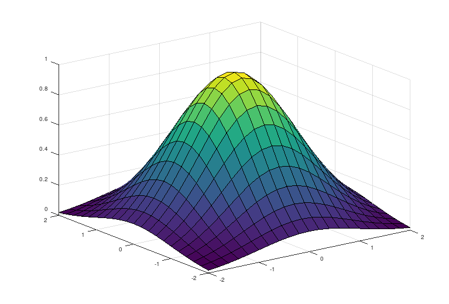

----

# Representation

Suppose that we are given a function $\phi : \mathbb{R^2} \longrightarrow \mathbb{R}$
such that $\forall x, y \in \mathbb{R},$ and
$$
\phi(x, y) = \exp\left[-\frac{1}{2}(x^2 + y^2)\right]
$$
```{r}
library(ggplot2) # import library for data visualization
phi <- function(x, y) exp(-0.5 * (x ** 2) + (y ** 2))

# some value of phi(x,y) for 0 <= x = y <= 0.5
phi(seq(0, 0.5, 0.05), seq(0, 0.5, 0.05))
```

The plot of $\phi(x,y)$ is below



In this case, we use real encoding for each genotype of the chromosomes. For example, [0.25, 0.32]. We denote
$$
\begin{align}
P &\equiv \text{Population} \\
P_i &\equiv \text{ith-Parent} \\
NP &\equiv \text{Population Size} \\
P_m &\equiv \text{Mutation Probability} \\
S &\equiv \text{Best solution}
\end{align}
$$
In this case, we define $NP = 7$ and $P_m = 0.3$

# Initial Population: Random Method

```{r}
xgen <- runif(7, min = -1, max = 1)
ygen <- runif(7, min = -1, max = 1)
popdf <- data.frame("xgenotype" = xgen, "ygenotype" = ygen, "fitness" = phi(xgen, ygen))
popdf
```
Sort the population respect with its fitness function
```{r}
dd <- transform(popdf, fitness = factor(popdf$fitness))
popdfsorted <- dd[ do.call(order, dd["fitness"]), ]
popdfsorted
```

# Selection: Roulette-Wheel

The construction of the roulette-wheel as follows. For each chromosome of the
population, that is $[x_i, y_i] \in P$ we have that
$$
\begin{align}
\mathbb{P}\{C = i\} = \frac{\phi(x_i, y_i)}{\sum_{j = 1}^{NP}\phi(x_j, y_j)}
&& \text{for } 1 \leq i \leq NP
\end{align}
$$

```{r}
SIGMA <- sum(popdf$fitness)
popdfsorted["pvalue"] <- phi(popdfsorted$xgenotype, popdfsorted$ygenotype) / SIGMA
popdfsorted
```

```{r}
# Create Data
data <- data.frame(
  group=paste(popdfsorted$pvalue * 100),
  value= popdfsorted$pvalue
)

# Basic piechart
ggplot(data, aes(x="", y=value, fill=group)) +
  geom_bar(stat="identity", width=1, color="white") +
  coord_polar("y", start=0) +
  theme_void() + ggtitle("Roulette-Wheel Selection")
```
Create roulette-wheel function
```{r}
roulette <- function(popdframe) {
  rouletteWheel <- runif(1, min = min(popdframe$pvalue), 
                         max = max(popdframe$pvalue))
  if (rouletteWheel > 0 && rouletteWheel <= popdframe$pvalue[1]) {
    parent <- c(popdframe$xgenotype[1], popdframe$ygenotype[1])
  } else if (rouletteWheel > popdframe$pvalue[1] && rouletteWheel <= popdframe$pvalue[2]) {
        parent <- c(popdframe$xgenotype[2], popdframe$ygenotype[2])
    } else if (rouletteWheel > popdframe$pvalue[2] && rouletteWheel <= popdframe$pvalue[3]) {
        parent <- c(popdframe$xgenotype[3], popdframe$ygenotype[3])
    } else if (rouletteWheel > popdframe$pvalue[3] && rouletteWheel <= popdframe$pvalue[4]) {
        parent <- c(popdframe$xgenotype[4], popdframe$ygenotype[4])
    } else if (rouletteWheel > popdframe$pvalue[4] && rouletteWheel <= popdframe$pvalue[5]) {
        parent <- c(popdframe$xgenotype[5], popdframe$ygenotype[5])
    } else if (rouletteWheel > popdframe$pvalue[5] && rouletteWheel <= popdframe$pvalue[6]) {
        parent <- c(popdframe$xgenotype[6], popdframe$ygenotype[6])
    } else if (rouletteWheel > popdframe$pvalue[6] && rouletteWheel <= popdframe$pvalue[7]) {
        parent <- c(popdframe$xgenotype[7], popdframe$ygenotype[7])
    }
  # print(rouletteWheel)
  return(parent)
}
```

Select two chromosome
```{r}
selection <- function(popdataframe) {
  stparents <- roulette(popdataframe)
  ndparents <- roulette(popdataframe)
  chromosomes <- matrix(c(stparents, ndparents),
                        nrow = 2, ncol = 2, byrow = TRUE)
  return(chromosomes)
}
selectedMatrix <- selection(popdfsorted)
selectedMatrix
```

# Crossover: $BLX-\alpha$

Given $P_1 = [p_{11}, p_{12}], P_2 = [p_{21}, p_{22}]$ and domains $x_1 \in [x_{11}, x_{12}]$
$, x_2 \in [x_{21}, x_{22}],$ let $0 < \alpha < 1$. Then the crossover $P_1$ and $P_2$
return a new child $P_{1}^{\ast} = [p_{11}^\ast, p_{12}^\ast], P_{2}^{\ast} = [p_{21}^\ast, p_{22}^\ast],$ which for each child's genotype, for $P_{1}^{\ast} = [p_{11}^\ast, p_{12}^\ast],$
$$
\begin{align}
p_{11}^{\ast} &= max\{l_i, min(p_{11}, p_{21}) - \alpha I_{i}^{\alpha}\} \\
p_{12}^{\ast} &= min\{u_i, max(p_{11,}, p_{21}) + \alpha I_{i}^{\alpha}\}
\end{align}
$$
and for $P_{2}^{\ast} = [p_{21}^\ast, p_{22}^\ast],$
$$
\begin{align}
p_{21}^{\ast} &= max\{l_i, min(p_{12}, p_{22}) - \alpha I_{i}^{\alpha}\} \\
p_{22}^{\ast} &= min\{u_i, max(p_{12,}, p_{22}) + \alpha I_{i}^{\alpha}\}
\end{align}
$$
Where $I_{i}^\alpha = abs(p_i^1 - p_i^2)$ and $l_i$ and $u_i$ are the domain of the variable, $x_i \in [l_i, u_i]$.
```{r}
pbxalpha <- function(selMat, constAlpha, stDomain, ndDomain) {
  stI <- abs(selMat[1, 1] - selMat[2, 1])
  ndI <- abs(selMat[1, 2] - selMat[2, 2])
  p11 <- max(stDomain[1], min(selMat[1, 1], selMat[2, 1]) - (constAlpha * stI))
  p12 <- min(stDomain[2], max(selMat[1, 1], selMat[2, 1]) + (constAlpha * stI))
  p21 <- max(ndDomain[1], min(selMat[1, 2], selMat[2, 2]) - (constAlpha * ndI))
  p22 <- min(ndDomain[2], max(selMat[1, 2], selMat[2, 2]) + (constAlpha * ndI))
  crossover <- matrix(c(p11, p12, p21, p22), nrow = 2, ncol = 2, byrow = TRUE)
  return(crossover)
}
offspring <- pbxalpha(selectedMatrix, runif(1, min = 0.01, max = 0.99), 
         stDomain = c(0.01, 0.99), ndDomain = c(0.01, 0.99))
offspring
```
# Mutation: Uniform and Norm Random Variables

Let $\beta > 0$. A variation vector $\Delta = [\delta_1, ..., \delta_i,..., \delta_N]$ , computed
as follows, is added up to the given solution $X = [x_1, ..., x_i, ..., x_N]$.
$$
\begin{align}
\delta_i &= \begin{cases}
(u_i - x_i)(1 - z_i)^\gamma && \text{if } \mathbb{P} = 1 / 2 \\
(l_i - x_i)(1 - z_i)^\gamma && \text{otherwise} \\
\end{cases} \\
\gamma &= \left(1 - \frac{t}{t_{max}}\right)^\beta
\end{align}
$$

where $0 \leq z_i \leq 1$ is an uniform random variable, $[u_i, l_i]$ are the
boundary of variable $x_i$, $t$ is the current number of generations, $t_{max}$
is the maximal number of generations.

In this case, $\Delta = [\delta_1, \delta_2], X = [x_1, x_2]$.
```{r}
computedGamma <- function(tCurrent, tMax, constBeta) (1 - (tCurrent / tMax)) ** constBeta
computedDelta <- function(theDomain, theVar, constGamma) {
  deltaVect <- c()
  for (i in seq(1, 2)) {
    drawProbability <- runif(1)
    stOutcome <- (theDomain[1] - theVar[i]) * (1 - runif(1)) ** constGamma
    ndOutcome <- (theDomain[2] - theVar[i]) * (1 - runif(1)) ** constGamma
    ifelse(drawProbability == (1 / 2),
             deltaVect <- append(deltaVect, stOutcome),
             deltaVect <- append(deltaVect, ndOutcome))
  }
  return(deltaVect)
}
mutation <- function(varDelta, varX) varDelta + varX
```
The computation for each offspring
```{r}
MUTATIONRATE <- 0.3

ismutate <- function(toOffspring, mutationProbability, maxgeneration) {
  mutationChance <- runif(1)
  if (mutationChance < MUTATIONRATE) {
    compGamma <- computedGamma(tCurrent = 1, tMax = maxgeneration, constBeta = 3)
    stCompDelta <- computedDelta(theDomain = c(0.01, 0.99), 
                               theVar = offspring[1,], constGamma = compGamma)
    ndCompDelta <- computedDelta(theDomain = c(0.01, 0.99), 
                                 theVar = offspring[2,], constGamma = compGamma)
    stCompMutation <- mutation(stCompDelta, offspring[1,])
    ndCompMutation <- mutation(ndCompDelta, offspring[2,])
    compMutation <- matrix(c(stCompMutation, ndCompMutation),
                           nrow = 2, ncol = 2, byrow = TRUE)
    return(compMutation)
  } else {
    return(offspring)
  }
}
ismutate(offspring, MUTATIONRATE, maxgeneration = 7)
```

```{r}
phi(-0.19153882, -0.9929124)
phi(0, 0)
```

# Repeat the Process

Define the global varible

```{r}
# Define the constant
NP <- 7
MAXGENERATION <- 50
MUTATIONRATE <- 0.3
STDOMAIN <- c(-0.99, 0.99)
NDDOMAIN <- c(-0.99, 0.99) 

generations[[1]] <- popdf
for (numberGeneration in seq(1, MAXGENERATION)) {
  xgenvect <- c()
  ygenvect <- c()
  while (length(xgenvect) < NP) {
    # Config the population
    workingPopulation <- generations[[numberGeneration]]
    dd <- transform(workingPopulation, 
                    fitness = factor(workingPopulation$fitness))
    workingPopulationSorted <- dd[ do.call(order, dd["fitness"]), ]
    
    SIGMA <- sum(workingPopulation$fitness)
    workingPopulationSorted["pvalue"] <- phi(workingPopulationSorted$xgenotype, workingPopulationSorted$ygenotype) / SIGMA
    
    # Selection
    selectIndividu <- selection(workingPopulationSorted)
    
    # Crossover
    getOffspring <- pbxalpha(selectIndividu,
                             constAlpha = runif(1, min = 0.01, max = 0.99),
                             stDomain = STDOMAIN, ndDomain = NDDOMAIN)
    # Mutation
    getOff <- ismutate(toOffspring = getOffspring,
                       mutationProbability = MUTATIONRATE,
                       maxgeneration = MAXGENERATION)
    
    # calculation the fitness by using the objective function
    stCalc <- phi(getOff[1, 1], getOff[1, 2])
    ndCalc <- phi(getOff[2, 1], getOff[2, 2])
    if (stCalc > ndCalc) {
      xgenvect <- append(xgenvect, getOff[1, 1])
      ygenvect <- append(ygenvect, getOff[1, 2])
    } else {
      xgenvect <- append(xgenvect, getOff[2, 1])
      ygenvect <- append(ygenvect, getOff[2, 2])
    }
  }
  getNewPopulation <- data.frame("xgenotype" = xgenvect,
                                 "ygenotype" = ygenvect,
                                 "fitness" = phi(xgenvect, ygenvect))
  generations[[numberGeneration + 1]] <- getNewPopulation
}
```

```{r}
for (n in seq(MAXGENERATION - 10, MAXGENERATION)) {
  print(n)
  print(generations[[n]])
}
```

